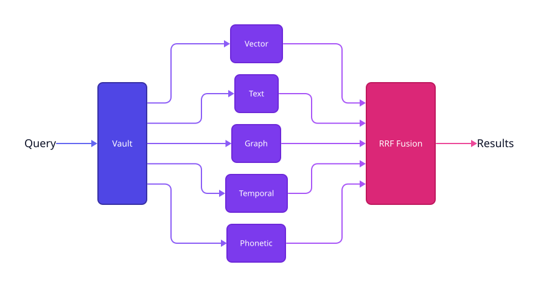

# oneiron

Embedded retrieval engine for memory-first applications. One binary, zero network hops.

Oneiron unifies **HNSW vector search**, **BM25 full-text**, **PPR graph traversal**, **phonetic matching**, and **bi-temporal indexing** inside a single LMDB-backed storage engine — then fuses results with **Reciprocal Rank Fusion**.

<picture>
  <source media="(prefers-color-scheme: dark)" srcset="./docs/architecture-dark.svg">
  <source media="(prefers-color-scheme: light)" srcset="./docs/architecture-light.svg">
  
</picture>

Five retrieval signals — vector, text, graph, temporal, phonetic — feed into RRF score fusion over 18 LMDB databases in a single environment per vault. One binary, one process, zero network hops.

## Features

- **HNSW vector search** — flat navigable small world graph, f32 vectors, dimension-agnostic, SIMD-accelerated (AVX2 / NEON / scalar fallback)
- **BM25 full-text search** — inverted index with term frequencies, document length normalization
- **Personalized PageRank** — seed-set graph traversal over typed, weighted edges with lazy cache invalidation
- **Bi-temporal indexing** — occurrence time vs. learned time, range queries on both dimensions
- **Phonetic matching** — voice-first fuzzy matching for ASR misspellings
- **RRF fusion** — combine any subset of signals with per-signal boosts
- **Atomic batch writes** — multi-database transactions via `BatchBuilder`
- **Context packing** — serialize retrieval results into LLM-ready formats (JSON, YAML, Markdown, plaintext)
- **Cross-platform** — server (x86_64), iOS/Android (aarch64), desktop (native)

## Quick Start

```rust
use oneiron::{Vault, VaultConfig, EntityId};

let config = VaultConfig::device(); // mobile preset
let vault = Vault::open("./my-vault", config)?;

let id = EntityId::now();
vault.put_entity(&id, b"msgpack blob")?;
vault.put_vector(&id, &embedding)?;
```

## Building

```sh
cargo build --release
cargo test
```

## Crate Structure

```
crates/
├── oneiron/         # core library
├── oneiron-ffi/     # C FFI for mobile
└── oneiron-bench/   # benchmarks
```

## Signals

| Signal | Index | Use |
|--------|-------|-----|
| Vector | HNSW (flat NSW) | Semantic similarity |
| Text | BM25 inverted index | Keyword / exact match |
| Graph | PPR over typed edges | Relational context |
| Temporal | Bi-temporal B-tree | Time-aware retrieval |
| Phonetic | Code → entity posting lists | Voice / fuzzy match |

## Design Docs

- [`SCHEMA-DESIGN.md`](./SCHEMA-DESIGN.md) — full database layout, key formats, encoding decisions
- [`BUILD-PROMPT.md`](./BUILD-PROMPT.md) — architecture spec, algorithms, API surface, known pitfalls
- [`DEPLOYMENT.md`](./DEPLOYMENT.md) — multi-vault deployment, ML infrastructure, operational concerns

## License

Apache 2.0
